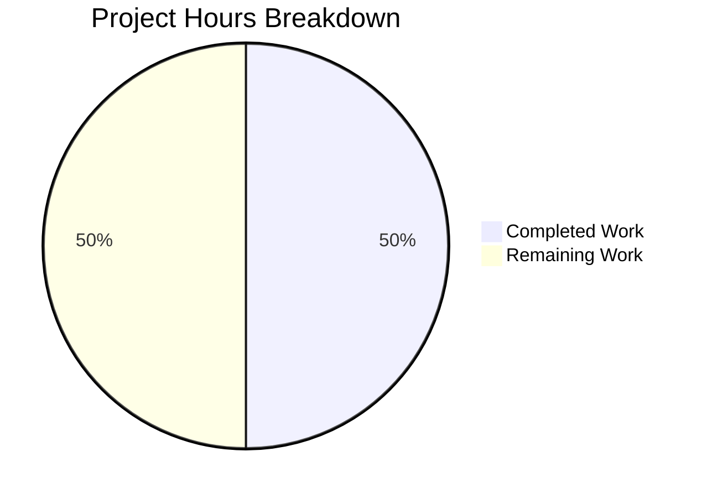

# Project Guide — Append Character 'a' to README.md

## 1. Executive Summary

This project implements a single-byte bug fix: appending the ASCII character `a` to the end of `README.md`, changing line 2 from `a` to `aa` and increasing the file size from 16 bytes to 17 bytes. The fix was applied in commit `dd7f431` on branch `blitzy-feaf0e04-e8af-4e84-8eee-e29b1798e3c4`.

**Completion: 1 hour completed out of 2 total hours = 50% complete.**

All development work — root cause diagnosis, fix implementation, and byte-level verification — is fully complete with zero remaining issues. The remaining 1 hour represents human governance tasks: reviewing the PR diff and approving/merging to main.

### Key Achievements
- Root cause definitively identified via byte-level analysis (`od -c`, `wc -c`, `tail -c`)
- Fix applied as a single atomic operation (`printf 'a' >> README.md`)
- All 8 verification checks pass (byte count, byte dump, trailing bytes, content, heading integrity, diff scope, diff content, clean working tree)
- Zero side effects: no whitespace changes, no encoding changes, no other files modified

### Critical Unresolved Issues
- **None.** All development work is complete and verified.

### Recommended Next Steps
1. Review the 1-line diff in the PR (line 2: `a` → `aa`)
2. Approve and merge to main

---

## 2. Validation Results Summary

### 2.1 Final Validator Findings

The Final Validator confirmed that the fix was already correctly applied and committed. All verification checks passed on the first run with no fixes required.

### 2.2 Verification Results (All 8 Checks Pass)

| # | Verification Step | Command | Expected Result | Actual Result | Status |
|---|-------------------|---------|-----------------|---------------|--------|
| 1 | Byte count | `wc -c README.md` | `17 README.md` | `17 README.md` | ✅ Pass |
| 2 | Byte-level dump | `od -c README.md` | Final two bytes: `a a` at 0x0F–0x10 | `a a` at 0x0F–0x10 | ✅ Pass |
| 3 | Trailing bytes | `tail -c 2 README.md \| od -c` | `0000000 a a` | `0000000 a a` | ✅ Pass |
| 4 | Content display | `cat README.md` | L1: `# quick-repo-5`, L2: `aa` | Matches exactly | ✅ Pass |
| 5 | Heading integrity | `head -1 README.md` | `# quick-repo-5` | `# quick-repo-5` | ✅ Pass |
| 6 | Git diff scope | `git diff --name-only` (commit) | Only `README.md` | Only `README.md` | ✅ Pass |
| 7 | Git diff content | `git diff` (commit) | L2: `-a` → `+aa` | Matches exactly | ✅ Pass |
| 8 | Working tree | `git status` | Clean | Clean | ✅ Pass |

### 2.3 Compilation, Build, and Test Results

Not applicable. This is a Markdown-only repository with:
- No executable code
- No dependencies or package manifests
- No build system or compilation step
- No test framework or test files

### 2.4 Fixes Applied During Validation

None required. The fix was already correctly applied by the implementation agent in commit `dd7f431`.

---

## 3. Hours Breakdown and Completion Assessment

### 3.1 Hours Calculation

**Completed Hours: 1 hour**
| Work Item | Hours |
|-----------|-------|
| Root cause diagnosis (byte-level analysis with `od`, `wc`, `tail`, `cat`, git history) | 0.25 |
| Fix implementation (`printf 'a' >> README.md`) and initial verification | 0.25 |
| Final validation (re-running all 8 verification checks, confirming clean working tree) | 0.25 |
| Commit preparation and push to remote branch | 0.25 |
| **Total Completed** | **1.00** |

**Remaining Hours: 1 hour** (human governance tasks with enterprise multipliers applied)
| Work Item | Base Hours | With Multipliers (×1.15 ×1.25) | Rounded |
|-----------|-----------|--------------------------------|---------|
| Review PR diff (1-line change: `a` → `aa`) | 0.25 | 0.36 | 0.50 |
| Approve and merge PR to main branch | 0.25 | 0.36 | 0.50 |
| **Total Remaining** | **0.50** | **0.72** | **1.00** |

**Total Project Hours: 1 + 1 = 2 hours**
**Completion: 1 / 2 = 50%**

### 3.2 Visual Representation



---

## 4. Detailed Task Table for Human Developers

All development work is complete. The remaining tasks are human governance activities.

| # | Task | Description | Action Steps | Hours | Priority | Severity |
|---|------|-------------|--------------|-------|----------|----------|
| 1 | Review PR Diff | Verify the 1-line change in `README.md` is correct: line 2 changes from `a` to `aa`, +1 byte | 1. Open PR on branch `blitzy-feaf0e04-e8af-4e84-8eee-e29b1798e3c4`<br>2. Review diff: confirm only `README.md` is modified<br>3. Verify line 2 change: `-a` → `+aa`<br>4. Confirm no other hunks or files | 0.5 | Medium | Low |
| 2 | Approve and Merge | Approve the PR and merge to main branch | 1. Approve the PR after review<br>2. Merge using preferred strategy (squash or merge commit)<br>3. Verify merge completed successfully<br>4. Optionally delete the feature branch | 0.5 | Medium | Low |
| | **Total Remaining Hours** | | | **1.0** | | |

**Verification: Task table total (1.0h) = Pie chart "Remaining Work" (1h) ✓**

---

## 5. Development Guide

### 5.1 System Prerequisites

| Requirement | Minimum Version | Purpose |
|-------------|----------------|---------|
| Git | 2.x+ | Version control, branch management |
| Terminal / Shell | Any POSIX shell (bash, zsh, sh) | Running verification commands |
| Text editor (optional) | Any | Viewing README.md content |

No other software is required. This repository contains only Markdown files — no programming languages, package managers, databases, or runtime environments are needed.

### 5.2 Environment Setup

```bash
# Clone the repository
git clone <repository-url>
cd quick-repo-5

# Switch to the feature branch
git checkout blitzy-feaf0e04-e8af-4e84-8eee-e29b1798e3c4
```

No environment variables, virtual environments, or service configurations are required.

### 5.3 Dependency Installation

Not applicable. This repository has no dependencies — no `package.json`, `requirements.txt`, `pom.xml`, `Gemfile`, or any other package manifest exists.

### 5.4 Verification Steps

After checking out the branch, run these commands to verify the fix:

```bash
# 1. Verify file size is 17 bytes
wc -c README.md
# Expected: 17 README.md

# 2. Verify byte-level content
od -c README.md
# Expected:
# 0000000   #       q   u   i   c   k   -   r   e   p   o   -   5  \n   a
# 0000020   a
# 0000021

# 3. Verify last two bytes are 'aa'
tail -c 2 README.md | od -c
# Expected: 0000000   a   a

# 4. Verify human-readable content
cat README.md
# Expected:
# # quick-repo-5
# aa

# 5. Verify heading is untouched
head -1 README.md
# Expected: # quick-repo-5

# 6. Verify only README.md was changed (in commit dd7f431)
git diff --name-only dd7f431^..dd7f431
# Expected: README.md

# 7. Verify the exact diff
git diff dd7f431^..dd7f431 -- README.md
# Expected: line 2 changes from '-a' to '+aa'
```

### 5.5 Troubleshooting

| Issue | Cause | Resolution |
|-------|-------|------------|
| `wc -c` shows 16 instead of 17 | Fix not applied | Run `printf 'a' >> README.md` |
| `wc -c` shows 18 or more | Extra characters appended | Reset file: `git checkout dd7f431 -- README.md` |
| Heading changed | Accidental modification to line 1 | Reset file: `git checkout dd7f431 -- README.md` |
| Trailing newline present | Wrong append method used (e.g., `echo` instead of `printf`) | Reset and re-apply: `git checkout dd7f431 -- README.md` |

---

## 6. Risk Assessment

### 6.1 Technical Risks

| Risk | Severity | Likelihood | Mitigation |
|------|----------|------------|------------|
| None identified | — | — | The change is a 1-byte append to a Markdown file with no code dependencies |

### 6.2 Security Risks

| Risk | Severity | Likelihood | Mitigation |
|------|----------|------------|------------|
| None identified | — | — | No executable code, credentials, or sensitive data involved |

### 6.3 Operational Risks

| Risk | Severity | Likelihood | Mitigation |
|------|----------|------------|------------|
| None identified | — | — | No deployment pipeline, services, or infrastructure affected |

### 6.4 Integration Risks

| Risk | Severity | Likelihood | Mitigation |
|------|----------|------------|------------|
| None identified | — | — | No external services, APIs, or dependencies to integrate |

### 6.5 Overall Risk Assessment

**Risk Level: None.** This is a single-byte Markdown change in a repository with no executable code, no dependencies, no build system, and no test framework. The change has been verified at byte level with 8 independent checks, all passing. There are zero blockers, zero known issues, and zero dependencies to resolve.

---

## 7. Repository Analysis

### 7.1 Repository Structure

```
quick-repo-5/
├── README.md                                    (17 bytes, UPDATED)
└── blitzy/
    └── documentation/
        ├── Project Guide.md                     (documentation artifact)
        └── Technical Specifications.md          (documentation artifact)
```

- **Total files:** 3 (excluding `.git/`)
- **Repository size:** 28K (excluding `.git/`)
- **File types:** All Markdown (`.md`)

### 7.2 Git History Summary

- **Branch:** `blitzy-feaf0e04-e8af-4e84-8eee-e29b1798e3c4`
- **Total commits on branch (vs. main):** 9
- **Fix commit:** `dd7f431` — `fix: append character 'a' to end of README.md (16 → 17 bytes)`
- **Files changed (vs. main):** 1 (`README.md`)
- **Lines changed:** 1 insertion, 1 deletion (line 2: `a` → `aa`)
- **Net bytes added:** +1 byte (16 → 17)

### 7.3 Change Scope Compliance

- ✅ Only `README.md` modified (confirmed by `git diff --name-only`)
- ✅ Only line 2 changed: `a` → `aa` (confirmed by `git diff`)
- ✅ Heading on line 1 untouched: `# quick-repo-5` (confirmed by `head -1`)
- ✅ No trailing newline added (confirmed by `od -c`)
- ✅ No other files in repository modified
- ✅ Working tree clean

---

## 8. Pre-Submission Consistency Checklist

- [x] Calculated completion % using hours formula: 1 / (1 + 1) = 50%
- [x] Verified Executive Summary states this exact %: "1 hour completed out of 2 total hours = 50% complete"
- [x] Verified pie chart uses exact completed/remaining hours: Completed=1, Remaining=1
- [x] Verified task table sums to exact remaining hours: 0.5 + 0.5 = 1.0h ✓
- [x] Searched report for any % or hour mentions — all match 50% and 1h/1h/2h
- [x] No conflicting or ambiguous statements exist
- [x] Shown the calculation formula with actual numbers: 1 / 2 = 50%