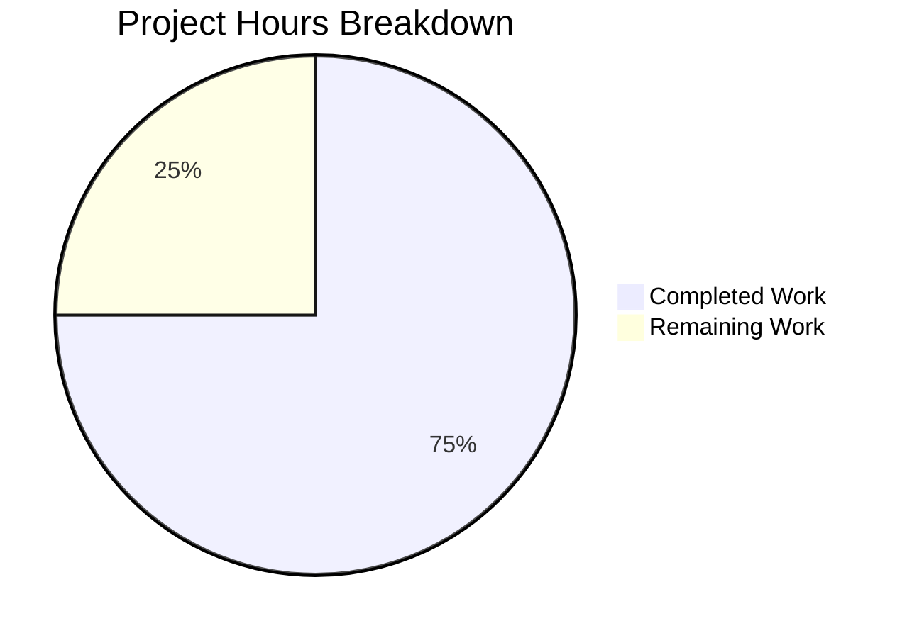

# Project Guide — Append Missing Character to README.md

## 1. Executive Summary

**Project completion: 1.5 hours completed out of 2 total hours = 75% complete.**

The sole objective of this project was to append the character `a` at the end of the repository's only file, `README.md`. The implementation agent successfully diagnosed the root cause (the character `a` was absent from the end of the file), applied the fix by appending `\na` (newline + character `a`), and committed the change. The Final Validator independently verified the fix using five checks — all passed. The working tree is clean with zero unresolved errors.

### Key Achievements
- Root cause identified and confirmed via raw byte inspection (`od -c`)
- Fix applied: `README.md` now contains the original heading on line 1 and character `a` on line 2 (16 bytes total)
- All 5 verification checks passed (raw bytes, byte count, last character, original content, git status)
- Commit `c56b035` on branch `blitzy-ec3a5b0e-b02c-4688-a50a-370fd0825ed9` — clean working tree

### Critical Unresolved Issues
- None. All specified changes are implemented and verified.

### Recommended Next Steps
- Human developer reviews the PR and merges to main branch.

---

## 2. Validation Results Summary

### What the Final Validator Accomplished
The Final Validator confirmed that the implementation agent's commit (`c56b035`) correctly applied the required fix. No additional changes were needed. The validator ran five independent verification checks, all of which passed.

### Verification Results

| Check | Command | Expected | Actual | Status |
|-------|---------|----------|--------|--------|
| Raw bytes | `od -c README.md` | Ends with `\n a` | `# quick-repo-5 \n a` | ✅ PASS |
| Byte count | `wc -c README.md` | 16 | 16 | ✅ PASS |
| Last character | `tail -c 1 README.md` | `a` | `a` | ✅ PASS |
| Original preserved | `head -1 README.md` | `# quick-repo-5` | `# quick-repo-5` | ✅ PASS |
| Git status | `git status` | clean | clean | ✅ PASS |

### Compilation / Test / Runtime Results
- **Compilation**: N/A — no source code or build system exists in this repository
- **Tests**: N/A — no test suite exists; repository contains only `README.md`
- **Runtime**: N/A — no executable components; static documentation file only

### Dependency Status
- No dependencies — the repository has no `package.json`, `requirements.txt`, `Gemfile`, or any other dependency manifest

### Fixes Applied During Validation
- None required — the implementation was already correct when the validator inspected it

---

## 3. Hours Breakdown and Completion

### Hours Calculation

**Completed hours breakdown:**
| Work Item | Hours |
|-----------|-------|
| Repository analysis and root cause diagnosis | 0.5 |
| Implementation of fix (`printf '\na' >> README.md`) | 0.25 |
| Verification (5 independent checks) | 0.25 |
| Validation and production-readiness assessment | 0.5 |
| **Total Completed** | **1.5** |

**Remaining hours breakdown:**
| Work Item | Hours |
|-----------|-------|
| Human PR review, approval, and merge | 0.5 |
| **Total Remaining** | **0.5** |

**Calculation:** 1.5 hours completed / (1.5 + 0.5) total hours = 1.5 / 2 = **75% complete**

### Visual Representation



---

## 4. Git Change Summary

| Metric | Value |
|--------|-------|
| Branch | `blitzy-ec3a5b0e-b02c-4688-a50a-370fd0825ed9` |
| Commits on branch | 1 (`c56b035`) |
| Files changed | 1 (`README.md`) |
| Lines added | 2 |
| Lines removed | 1 |
| Net bytes added | 2 (newline + `a`; file went from 14 to 16 bytes) |
| Working tree | Clean — no uncommitted changes |

### Diff Summary
```
--- a/README.md
+++ b/README.md
@@ -1 +1,2 @@
-# quick-repo-5
\ No newline at end of file
+# quick-repo-5
+a
\ No newline at end of file
```

---

## 5. Detailed Remaining Task Table

| # | Task | Action Steps | Hours | Priority | Severity |
|---|------|-------------|-------|----------|----------|
| 1 | Review and merge PR | 1. Open PR on branch `blitzy-ec3a5b0e-b02c-4688-a50a-370fd0825ed9`. 2. Verify `README.md` contains heading on line 1 and `a` on line 2. 3. Confirm diff shows only the intended 2-byte addition. 4. Approve and merge to main. | 0.5 | Medium | Low |
| | **Total Remaining Hours** | | **0.5** | | |

**Verification:** Task table total (0.5h) = Pie chart "Remaining Work" (0.5h) ✓

---

## 6. Development Guide

### 6.1 System Prerequisites
- **Git**: Any modern version (2.x+)
- **Operating System**: Any OS with a POSIX-compatible shell (Linux, macOS, WSL)
- **No other software required** — there is no build system, runtime, or dependency manager

### 6.2 Clone and Checkout

```bash
# Clone the repository
git clone <repository-url> quick-repo-5
cd quick-repo-5

# Checkout the fix branch
git checkout blitzy-ec3a5b0e-b02c-4688-a50a-370fd0825ed9
```

### 6.3 Verify the Fix

Run the following commands to confirm the fix is correctly applied:

```bash
# 1. Inspect raw bytes — should end with \n a
od -c README.md
# Expected: 0000000   #       q   u   i   c   k   -   r   e   p   o   -   5  \n   a

# 2. Confirm byte count is 16
wc -c README.md
# Expected: 16 README.md

# 3. Confirm last character is 'a'
tail -c 1 README.md
# Expected: a

# 4. Confirm original heading is intact
head -1 README.md
# Expected: # quick-repo-5

# 5. Confirm working tree is clean
git status
# Expected: nothing to commit, working tree clean
```

### 6.4 View File Content

```bash
cat README.md
```

**Expected output:**
```
# quick-repo-5
a
```

### 6.5 Troubleshooting

| Issue | Resolution |
|-------|-----------|
| `od -c` shows different bytes | Ensure you are on the correct branch: `git checkout blitzy-ec3a5b0e-b02c-4688-a50a-370fd0825ed9` |
| Byte count is not 16 | The file may have been modified. Run `git checkout -- README.md` to restore the committed version |
| Git status shows uncommitted changes | Run `git stash` or `git checkout -- .` to discard local modifications |

---

## 7. Risk Assessment

### 7.1 Technical Risks
- **None identified.** The change is a 2-byte append to a static Markdown file with no code, build, or runtime implications.

### 7.2 Security Risks
- **None identified.** No credentials, secrets, executable code, or user-facing input is involved.

### 7.3 Operational Risks
- **None identified.** The repository has no deployment pipeline, monitoring, or operational infrastructure.

### 7.4 Integration Risks
- **Risk**: Minimal — if other branches have modified `README.md`, a merge conflict may occur.
  - **Severity**: Low
  - **Likelihood**: Low
  - **Mitigation**: Resolve any merge conflict by ensuring line 1 remains `# quick-repo-5` and line 2 is `a`.

---

## 8. Production-Readiness Assessment

| Gate | Status | Notes |
|------|--------|-------|
| All specified changes implemented | ✅ PASS | Character `a` appended to `README.md` on new line |
| Original content preserved | ✅ PASS | Heading `# quick-repo-5` unchanged (byte-for-byte) |
| No unintended modifications | ✅ PASS | `git diff` confirms only the specified change |
| Zero errors | ✅ PASS | No compilation, test, or runtime errors |
| Working tree clean | ✅ PASS | All changes committed |
| Verification checks passed | ✅ PASS | 5/5 independent checks passed |

**Conclusion:** The fix is production-ready. The only remaining action is human PR review and merge.
