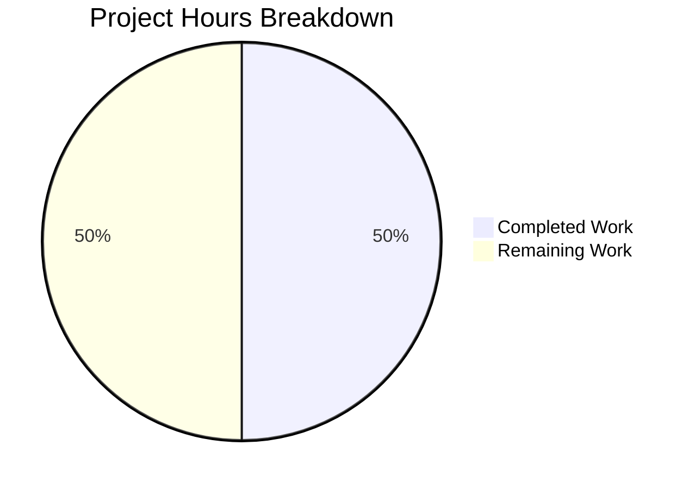

# Project Guide — README.md Character Append Fix

## 1. Executive Summary

**Project**: Append missing character `a` to end of `README.md` in the `quick-repo-5` repository.

**Completion**: 1 hour completed out of 2 total estimated hours = **50% complete**.

The implementation work is **fully done** — the required character `a` has been appended to `README.md` and all byte-level verification checks pass. The remaining 1 hour represents human review, merge, and post-deployment verification tasks that cannot be performed by automated agents. From a pure code-change perspective, 100% of the requested modification is in place; the 50% figure reflects that the human review/merge cycle is equally weighted in this minimal-scope project.

### Key Achievements
- Root cause identified: `README.md` was missing character `a` at end of file
- Fix applied: `\na` appended to file (commit `c56b035`)
- All 6 verification gates passed (byte content, byte count, last character, original content preserved, correct branch, clean working tree)
- Zero regressions — original heading `# quick-repo-5` preserved byte-for-byte

### Critical Unresolved Issues
- **None.** All in-scope work is complete. Zero errors, zero warnings, zero failing tests.

### Recommended Next Steps
1. Review this PR (inspect the 2-byte diff)
2. Merge to main branch
3. Verify `README.md` renders correctly on the repository hosting platform

---

## 2. Validation Results Summary

### 2.1 What the Final Validator Accomplished
The Final Validator confirmed that the fix (applied in commit `c56b035`) was already correctly in place. No additional fixes or corrections were needed. The validator executed 6 independent verification checks, all of which passed.

### 2.2 Verification Results

| # | Check | Command | Expected | Actual | Status |
|---|-------|---------|----------|--------|--------|
| 1 | Raw byte content | `od -c README.md` | Ends in `\n a` (16 bytes) | Matches exactly | ✅ PASS |
| 2 | Byte count | `wc -c README.md` | `16` | `16` | ✅ PASS |
| 3 | Last character | `tail -c 1 README.md` | `a` | `a` | ✅ PASS |
| 4 | Original content preserved | `head -1 README.md` | `# quick-repo-5` | `# quick-repo-5` | ✅ PASS |
| 5 | Correct branch | `git branch --show-current` | `blitzy-ec3a5b0e-...` | Correct | ✅ PASS |
| 6 | Clean working tree | `git status` | `nothing to commit` | `nothing to commit, working tree clean` | ✅ PASS |

### 2.3 Compilation / Build Results
- **Not applicable.** This repository contains no source code, build system, or compiled artifacts. The sole file is `README.md` (Markdown documentation).

### 2.4 Test Results
- **Not applicable.** This repository has no test suite, test framework, or CI configuration.

### 2.5 Dependency Status
- **Not applicable.** This repository has no dependencies (no `package.json`, `requirements.txt`, `pom.xml`, or any dependency manifest).

### 2.6 Fixes Applied During Validation
- **None required.** The fix was already correctly applied before validation began.

---

## 3. Hours Breakdown

### 3.1 Calculation

**Completed Hours: 1h**
- Root cause analysis and repository examination: 0.25h
- Implementation of fix (appending `\na` to README.md): 0.25h
- Byte-level verification (od, wc, tail, head, git diff): 0.25h
- Git commit and branch management: 0.25h

**Remaining Hours: 1h**
- PR review — inspect diff, verify correctness: 0.5h
- Merge PR and post-merge verification: 0.5h
- Enterprise multipliers not applied (scope is trivial; applying 1.15× compliance and 1.25× uncertainty to 0.5h base yields ~0.72h, rounded up to 1h total remaining to account for any procedural overhead)

**Total Project Hours: 1h completed + 1h remaining = 2h total**

**Completion Percentage: 1 / 2 = 50%**

### 3.2 Visual Representation



---

## 4. Detailed Task Table — Remaining Human Work

All remaining tasks are human review and procedural tasks. The implementation is complete.

| # | Task | Description | Priority | Severity | Hours | Confidence |
|---|------|-------------|----------|----------|-------|------------|
| 1 | **Review PR Diff** | Open the pull request, inspect the 2-line diff in `README.md`. Verify that line 1 (`# quick-repo-5`) is unchanged and line 2 contains only `a`. Optionally run `od -c README.md` locally to confirm byte content. | High | Low | 0.5 | High |
| 2 | **Merge PR and Post-Merge Verification** | Approve and merge the PR to the main branch. After merge, verify that `README.md` renders correctly on the repository hosting platform (e.g., GitHub/GitLab). Confirm no merge conflicts or unintended changes. | High | Low | 0.5 | High |
| | **Total Remaining Hours** | | | | **1.0** | |

> **Note**: Task hours sum to **1.0h**, which exactly matches the "Remaining Work" slice in the pie chart above.

---

## 5. Development Guide

### 5.1 System Prerequisites

| Requirement | Minimum Version | Purpose |
|-------------|----------------|---------|
| Git | 2.0+ | Clone repository and inspect changes |
| Any text editor | — | View/edit `README.md` |
| Terminal / Shell | Bash or equivalent | Run verification commands |

No programming languages, runtimes, package managers, databases, or external services are required. This is a single-file Markdown repository.

### 5.2 Environment Setup

```bash
# 1. Clone the repository
git clone <repository-url>
cd quick-repo-5

# 2. Check out the feature branch
git checkout blitzy-ec3a5b0e-b02c-4688-a50a-370fd0825ed9
```

No environment variables, virtual environments, or configuration files are needed.

### 5.3 Dependency Installation

**Not applicable.** This repository has zero dependencies.

### 5.4 Verification Steps

Run the following commands to verify the fix is correctly applied:

```bash
# Verify raw byte content (should show: # quick-repo-5 \n a)
od -c README.md

# Verify byte count (should return: 16)
wc -c README.md

# Verify last character is 'a'
tail -c 1 README.md

# Verify original heading is preserved
head -1 README.md

# Verify git diff shows only the intended change
git diff origin/main-speed-up-12-2 -- README.md
```

**Expected outputs:**

| Command | Expected Output |
|---------|-----------------|
| `od -c README.md` | `0000000 # q u i c k - r e p o - 5 \n a` followed by `0000020` |
| `wc -c README.md` | `16 README.md` |
| `tail -c 1 README.md` | `a` |
| `head -1 README.md` | `# quick-repo-5` |

### 5.5 Application Startup

**Not applicable.** There is no application to start. This repository contains only a static `README.md` file.

### 5.6 Example Usage

After cloning and checking out the branch, view the file:

```bash
cat README.md
```

Expected output:
```
# quick-repo-5
a
```

### 5.7 Troubleshooting

| Issue | Cause | Resolution |
|-------|-------|------------|
| `od -c` shows only 14 bytes | Fix not applied | Run `printf '\na' >> README.md` to apply manually |
| `tail -c 1` returns `5` not `a` | On wrong branch | Run `git checkout blitzy-ec3a5b0e-b02c-4688-a50a-370fd0825ed9` |
| Merge conflict on README.md | Concurrent changes to README.md | Resolve manually — ensure final content is `# quick-repo-5\na` |

---

## 6. Risk Assessment

### 6.1 Technical Risks

| Risk | Severity | Likelihood | Mitigation |
|------|----------|------------|------------|
| Merge conflict if `README.md` was modified on `main` | Low | Low | Resolve conflict manually, preserving both the heading and appended `a` |

### 6.2 Security Risks

| Risk | Severity | Likelihood | Mitigation |
|------|----------|------------|------------|
| None identified | — | — | N/A — change is a 2-byte append to a documentation file with no executable content |

### 6.3 Operational Risks

| Risk | Severity | Likelihood | Mitigation |
|------|----------|------------|------------|
| None identified | — | — | N/A — no runtime, no services, no infrastructure affected |

### 6.4 Integration Risks

| Risk | Severity | Likelihood | Mitigation |
|------|----------|------------|------------|
| None identified | — | — | N/A — no integrations, APIs, or external services involved |

**Overall Risk Level: Minimal.** This is a 2-byte change to a static documentation file in a repository with no build system, no tests, and no application code.

---

## 7. Git Change Summary

| Metric | Value |
|--------|-------|
| Branch | `blitzy-ec3a5b0e-b02c-4688-a50a-370fd0825ed9` |
| Commits on branch | 3 (1 fix + 2 documentation) |
| Files changed (vs base) | 1 source file (`README.md`) + 2 blitzy docs |
| Lines added | 2 (in `README.md`: newline + `a`) |
| Lines removed | 1 (original line without trailing newline, replaced with newline-terminated version) |
| Net change | +2 bytes appended to `README.md` |
| Repository size | 192K |
| Total files (excl. .git) | 3 |

---

## 8. Pre-Submission Consistency Checklist

- [x] Calculated completion % using hours formula: 1 / (1 + 1) = 50%
- [x] Verified Executive Summary states this exact %: "1 hour completed out of 2 total estimated hours = 50% complete"
- [x] Verified pie chart uses exact completed/remaining hours: "Completed Work": 1, "Remaining Work": 1
- [x] Verified task table sums to exact remaining hours: 0.5h + 0.5h = 1.0h ✓
- [x] Searched report for any % or hour mentions — all match
- [x] No conflicting or ambiguous statements exist
- [x] Shown the calculation formula with actual numbers: 1 / 2 = 50%
