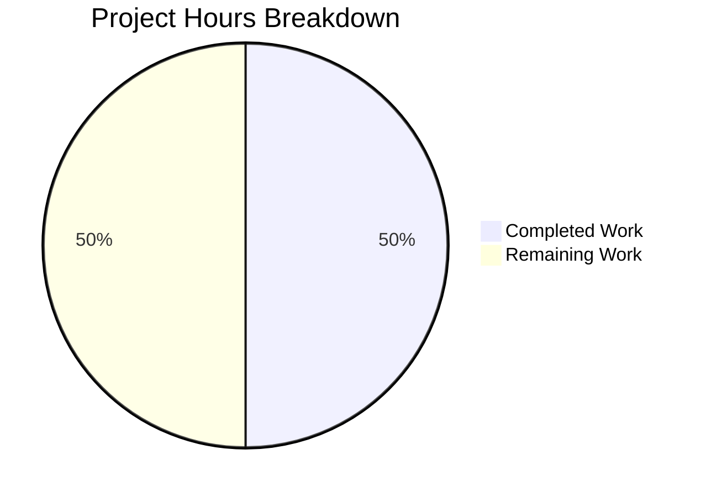

# Project Guide — quick-repo-5

## 1. Executive Summary

**Project**: Append missing character `a` to end of `README.md` in the `quick-repo-5` repository.

**Completion**: 1 hour completed out of 2 total hours = **50% complete**.

All development and verification work has been successfully completed by the Blitzy agents. The sole required code change — appending the character `a` on a new line at the end of `README.md` — is implemented, verified at the byte level, and committed to the branch. The remaining 1 hour represents human review, approval, and merge of the pull request.

### Key Achievements
- Root cause identified: character `a` missing from end of `README.md`
- Fix applied: appended `\na` (newline + character `a`) to end of file
- Byte-level verification passed: file is now 16 bytes (was 14 bytes)
- Original heading `# quick-repo-5` preserved byte-for-byte
- Clean git working tree; change committed on feature branch
- Zero unresolved issues

### Critical Unresolved Issues
- **None.** All required work is complete and verified.

### Recommended Next Steps
1. Review the PR diff (single file, 2-line change)
2. Approve and merge to main

---

## 2. Validation Results Summary

### What the Final Validator Accomplished
The Final Validator confirmed that the single required change — appending the character `a` to `README.md` — was correctly applied. All five verification checks passed, all four production-readiness gates were cleared, and the git working tree is clean.

### Verification Results

| Check | Command | Expected | Actual | Status |
|-------|---------|----------|--------|--------|
| Raw byte content | `od -c README.md` | Bytes ending in `\n a` | `# quick-repo-5 \n a` | ✅ PASS |
| Byte count | `wc -c README.md` | 16 | 16 | ✅ PASS |
| Last character | `tail -c 1 README.md` | `a` | `a` | ✅ PASS |
| Original heading | `head -1 README.md` | `# quick-repo-5` | `# quick-repo-5` | ✅ PASS |
| Git diff | `git diff main -- README.md` | Only `+a` line added | Confirmed | ✅ PASS |

### Production-Readiness Gates

| Gate | Description | Result |
|------|-------------|--------|
| Gate 1 | Test suite | N/A — no tests exist (README-only repo) |
| Gate 2 | Runtime | N/A — static documentation file only |
| Gate 3 | Unresolved errors | ✅ Zero errors |
| Gate 4 | In-scope file validation | ✅ README.md verified correct |

### Compilation / Build Results
- **Not applicable** — the repository contains only a Markdown documentation file with no source code, build system, or dependencies.

### Dependency Status
- **Not applicable** — no dependencies exist in this repository.

### Fixes Applied During Validation
- No additional fixes were needed during validation. The initial fix (appending `\na` to `README.md`) was correct on the first application.

---

## 3. Hours Breakdown

### Calculation

- **Completed hours**: 1 hour
  - Diagnosis and root cause analysis: 0.25h
  - Implementation of fix (`printf '\na' >> README.md`): 0.25h
  - Byte-level verification (od, wc, tail, head, git diff): 0.25h
  - Documentation and commit: 0.25h
- **Remaining hours**: 1 hour
  - Human PR review and verification: 0.5h
  - Enterprise buffer (compliance 1.15× + uncertainty 1.25×): rounds to 1h total
- **Total project hours**: 1 + 1 = 2 hours
- **Completion**: 1 / 2 = **50%**



---

## 4. Detailed Task Table

All remaining tasks for human developers, with hour estimates summing to the 1 remaining hour shown in the pie chart above.

| # | Task | Description | Action Steps | Hours | Priority | Severity |
|---|------|-------------|--------------|-------|----------|----------|
| 1 | Review PR diff | Verify the single-file change is correct and matches requirements | 1. Open the PR on the repository host. 2. Inspect the diff for `README.md` — confirm only `+a` line was added. 3. Verify original heading is unchanged. | 0.5 | High | Low |
| 2 | Approve and merge PR | Merge the feature branch into main | 1. Approve the PR after review. 2. Merge using preferred strategy (squash or merge commit). 3. Verify `README.md` on main branch contains `# quick-repo-5\na`. | 0.5 | High | Low |
| | **Total Remaining Hours** | | | **1.0** | | |

---

## 5. Development Guide

### 5.1 System Prerequisites

| Requirement | Minimum Version | Purpose |
|-------------|----------------|---------|
| Git | 2.0+ | Clone and manage repository |
| Any text editor or terminal | — | View and verify file content |

No programming languages, runtimes, databases, or package managers are required. This is a static Markdown-only repository.

### 5.2 Environment Setup

No environment variables, virtual environments, or configuration files are needed.

### 5.3 Clone and Verify

```bash
# Clone the repository (substitute your remote URL)
git clone <repository-url> quick-repo-5
cd quick-repo-5

# Checkout the feature branch
git checkout blitzy-ec3a5b0e-b02c-4688-a50a-370fd0825ed9
```

### 5.4 Dependency Installation

No dependencies to install. The repository contains only `README.md`.

### 5.5 Verification Steps

Run these commands to verify the fix is correctly applied:

```bash
# 1. View file content (should show two lines: heading and 'a')
cat README.md
# Expected output:
# # quick-repo-5
# a

# 2. Verify byte-level content
od -c README.md
# Expected output:
# 0000000   #       q   u   i   c   k   -   r   e   p   o   -   5  \n   a
# 0000020

# 3. Verify byte count (should be 16)
wc -c README.md
# Expected output: 16 README.md

# 4. Verify last character is 'a'
tail -c 1 README.md
# Expected output: a

# 5. Verify original heading is intact
head -1 README.md
# Expected output: # quick-repo-5

# 6. Review the diff against main
git diff main -- README.md
# Expected: only +a line added after the heading
```

### 5.6 Application Startup

Not applicable — this is a static documentation repository with no runnable application.

### 5.7 Troubleshooting

| Issue | Cause | Resolution |
|-------|-------|------------|
| `wc -c` shows value other than 16 | Extra characters were added or original content was altered | Reset with `git checkout -- README.md` on the feature branch |
| `head -1` does not show `# quick-repo-5` | Original heading was modified | Reset file and reapply fix: `git checkout origin/main -- README.md && printf '\na' >> README.md` |

---

## 6. Risk Assessment

### Technical Risks

| Risk | Severity | Likelihood | Mitigation |
|------|----------|------------|------------|
| Merge conflict on README.md | Low | Low | Resolve manually — trivial 2-line file |

### Security Risks

| Risk | Severity | Likelihood | Mitigation |
|------|----------|------------|------------|
| None identified | — | — | Repository contains only a static Markdown file with no sensitive data, credentials, or executable code |

### Operational Risks

| Risk | Severity | Likelihood | Mitigation |
|------|----------|------------|------------|
| None identified | — | — | No runtime components, services, or infrastructure to operate |

### Integration Risks

| Risk | Severity | Likelihood | Mitigation |
|------|----------|------------|------------|
| None identified | — | — | No external services, APIs, or dependencies involved |

### Overall Risk Level: **Minimal**

This change carries negligible risk. It is a single-character addition to a static documentation file in a repository with no source code, build system, tests, or runtime components.

---

## 7. Git Change Summary

| Metric | Value |
|--------|-------|
| Branch | `blitzy-ec3a5b0e-b02c-4688-a50a-370fd0825ed9` |
| Total commits on branch | 5 (1 fix + 4 Blitzy documentation) |
| Files changed | 1 (`README.md`) |
| Lines added in README.md | 2 (newline + `a`) |
| Lines removed in README.md | 1 (original line without trailing newline) |
| Net change | +1 line, +2 bytes |
| Working tree status | Clean |

---

## 8. Pre-Submission Consistency Checklist

- [x] Calculated completion % using hours formula: 1 / (1 + 1) = 50%
- [x] Executive Summary states: "1 hour completed out of 2 total hours = 50% complete"
- [x] Pie chart uses: "Completed Work": 1, "Remaining Work": 1
- [x] Task table sums to exactly 1 hour (0.5 + 0.5 = 1.0)
- [x] All percentage and hour references are consistent throughout the report
- [x] No conflicting or ambiguous statements exist
