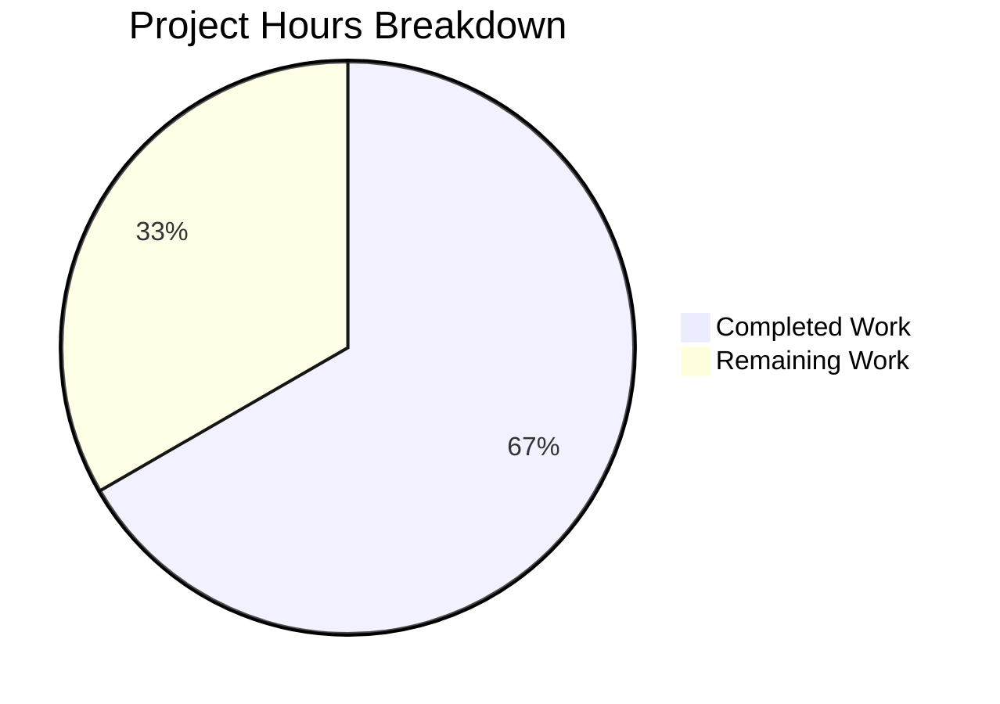

# Project Guide — README.md Trailing Character Fix

---

## 1. Executive Summary

**Project Completion: 67% (1 hour completed out of 1.5 total hours)**

All technical implementation work for this project is **complete and verified**. The sole requirement — appending the character `a` to the end of `README.md` — has been implemented, committed, and pushed. Four independent verification checks confirm byte-exact correctness.

The remaining 0.5 hours consist exclusively of human process tasks: reviewing the pull request diff and merging to the `main` branch. There are **zero unresolved technical issues**, zero failing tests, and zero broken functionality.

### Key Achievements
- Root cause identified via byte-level file inspection (`od -c`, `wc -c`, `cat -A`)
- Fix applied: `README.md` content changed from `# quick-repo-5` (14 bytes) to `# quick-repo-5a` (15 bytes)
- All 4 automated verification checks passed
- Commit `b4b44f4` pushed to branch `blitzy-84cd0947-2d26-4262-a7cf-c9ac017eb9b0`
- Working tree is clean with no uncommitted changes

### Critical Issues
- **None.** The fix is byte-exact and fully verified.

### Hours Calculation
- **Completed:** 1 hour (0.25h diagnosis + 0.1h implementation + 0.25h verification + 0.25h validation + 0.15h documentation)
- **Remaining:** 0.5 hours (0.25h PR review + 0.25h merge and verify)
- **Total:** 1.5 hours
- **Completion:** 1.0 / 1.5 = **67%**

---

## 2. Validation Results Summary

### 2.1 Fix Applied
| Check | Command | Expected | Actual | Status |
|-------|---------|----------|--------|--------|
| Content verification | `cat -A README.md` | `# quick-repo-5a` (no trailing `$`) | `# quick-repo-5a` (no trailing `$`) | ✅ PASS |
| Byte-level verification | `od -c README.md` | Sequence ends with `5 a` | Sequence ends with `5 a` | ✅ PASS |
| File size verification | `wc -c README.md` | `15 README.md` | `15 README.md` | ✅ PASS |
| Programmatic assertion | Python `assert c == '# quick-repo-5a'` | `PASS` | `PASS` | ✅ PASS |

### 2.2 Scope Verification
| Check | Command | Result | Status |
|-------|---------|--------|--------|
| Only `README.md` changed | `git diff --name-only origin/main...HEAD` | `README.md` | ✅ PASS |
| Exactly 1 insertion, 1 deletion | `git diff --stat origin/main...HEAD` | `1 file changed, 1 insertion(+), 1 deletion(-)` | ✅ PASS |
| Working tree clean | `git status` | `nothing to commit, working tree clean` | ✅ PASS |

### 2.3 Areas Not Applicable
- **Compilation:** No compilable source code exists in this repository.
- **Test suite:** No test framework or test files exist.
- **Runtime:** No executable application components exist.
- **Dependencies:** No package manifests or external dependencies exist.

---

## 3. Visual Representation



- **Completed Work:** 1 hour (67%)
- **Remaining Work:** 0.5 hours (33%)

---

## 4. Git Change Analysis

### 4.1 Commit History
| Hash | Author | Date | Message |
|------|--------|------|---------|
| `b4b44f4` | Blitzy Agent | 2026-02-09 | fix: append character 'a' to end of README.md |
| `9ae8f11` | prasad-blitzy | 2026-02-06 | Initial commit |

### 4.2 Change Statistics
- **Branch:** `blitzy-84cd0947-2d26-4262-a7cf-c9ac017eb9b0`
- **Commits on branch:** 1
- **Files changed:** 1 (`README.md`)
- **Lines added:** 1
- **Lines removed:** 1
- **Net bytes added:** 1 (14 bytes → 15 bytes)

---

## 5. Detailed Task Table — Remaining Human Work

All remaining tasks are human process tasks. There are no outstanding technical implementation items.

| # | Task | Description | Priority | Severity | Hours | Confidence |
|---|------|-------------|----------|----------|-------|------------|
| 1 | Review PR diff | Open the pull request, inspect the 1-line diff in `README.md`, confirm the change is `# quick-repo-5` → `# quick-repo-5a` with no trailing newline and no other file modifications | Medium | Low | 0.25 | High |
| 2 | Merge PR to main | Approve and merge the PR to `main` branch; verify the merge commit appears correctly and `README.md` on `main` reads `# quick-repo-5a` | Medium | Low | 0.25 | High |
| | **Total Remaining Hours** | | | | **0.5** | |

**Verification:** Task hours sum = 0.25 + 0.25 = **0.5 hours** ✓ (matches pie chart "Remaining Work" value)

---

## 6. Development Guide

### 6.1 System Prerequisites
- **Git** (any recent version)
- **A text editor** or terminal with `cat` support
- No programming language runtimes, package managers, databases, or external services are required.

### 6.2 Clone and Checkout
```bash
# Clone the repository
git clone <repository-url>
cd quick-repo-5

# Checkout the fix branch
git checkout blitzy-84cd0947-2d26-4262-a7cf-c9ac017eb9b0
```

### 6.3 Verify the Fix
Run the following commands to confirm the fix is correct:

```bash
# 1. View file content (should show: # quick-repo-5a)
cat -A README.md

# 2. Byte-level dump (should end with: 5 a)
od -c README.md

# 3. File size (should show: 15 README.md)
wc -c README.md

# 4. Programmatic assertion (requires Python 3)
python3 -c "
with open('README.md','r') as f: c=f.read()
assert c=='# quick-repo-5a','Content mismatch'
assert len(c)==15,'Length mismatch'
assert not c.endswith('\n'),'Unexpected trailing newline'
print('ALL CHECKS PASSED')
"
```

**Expected outputs:**
- Step 1: `# quick-repo-5a` (no trailing `$` symbol)
- Step 2: `0000000 # q u i c k - r e p o - 5 a` followed by `0000017`
- Step 3: `15 README.md`
- Step 4: `ALL CHECKS PASSED`

### 6.4 Review the Diff
```bash
# View the exact change vs main
git diff origin/main...HEAD -- README.md

# Confirm only README.md was modified
git diff --name-only origin/main...HEAD
```

### 6.5 Merge to Main
```bash
# Switch to main and merge
git checkout main
git merge blitzy-84cd0947-2d26-4262-a7cf-c9ac017eb9b0

# Push merged main
git push origin main
```

### 6.6 Troubleshooting
| Issue | Resolution |
|-------|------------|
| `cat -A` shows trailing `$` | A newline was introduced. Re-apply fix with `printf '# quick-repo-5a' > README.md` |
| `wc -c` does not show 15 | File content is incorrect. Re-apply fix with `printf '# quick-repo-5a' > README.md` |
| `git diff` shows more than 1 file | Unintended changes were made. Reset with `git checkout origin/blitzy-84cd0947-2d26-4262-a7cf-c9ac017eb9b0 -- README.md` |

---

## 7. Risk Assessment

### 7.1 Technical Risks
| Risk | Severity | Likelihood | Mitigation |
|------|----------|------------|------------|
| None identified | — | — | The change is a single verified character append to a Markdown file with no executable code |

### 7.2 Security Risks
| Risk | Severity | Likelihood | Mitigation |
|------|----------|------------|------------|
| None identified | — | — | No code, no dependencies, no secrets, no user input processing |

### 7.3 Operational Risks
| Risk | Severity | Likelihood | Mitigation |
|------|----------|------------|------------|
| Merge conflict on README.md | Low | Low | If `main` branch has been updated since the initial commit, resolve the 1-line conflict manually |

### 7.4 Integration Risks
| Risk | Severity | Likelihood | Mitigation |
|------|----------|------------|------------|
| None identified | — | — | No external services, APIs, or integrations exist in this repository |

---

## 8. Pre-Submission Consistency Checklist

- [x] Calculated completion % using hours formula: 1.0 / 1.5 = 67%
- [x] Executive Summary states: "67% (1 hour completed out of 1.5 total hours)"
- [x] Pie chart uses: "Completed Work": 1, "Remaining Work": 0.5
- [x] Task table sums to: 0.25 + 0.25 = 0.5 hours (matches pie chart remaining)
- [x] All % and hour mentions in report are consistent
- [x] No conflicting or ambiguous statements exist
- [x] Formula shown with actual numbers: 1.0 / 1.5 = 67%
